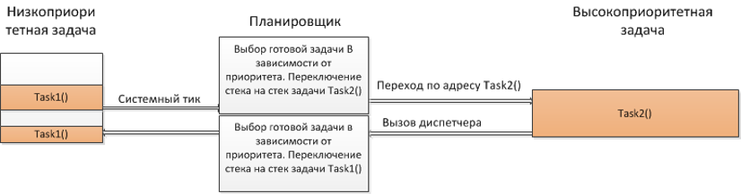
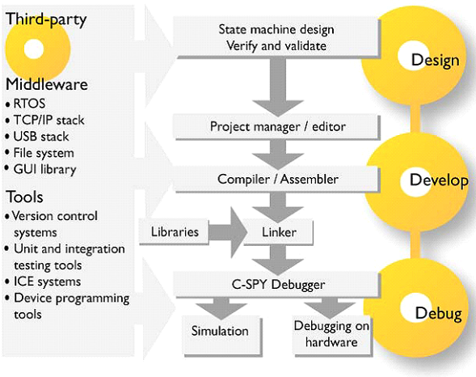
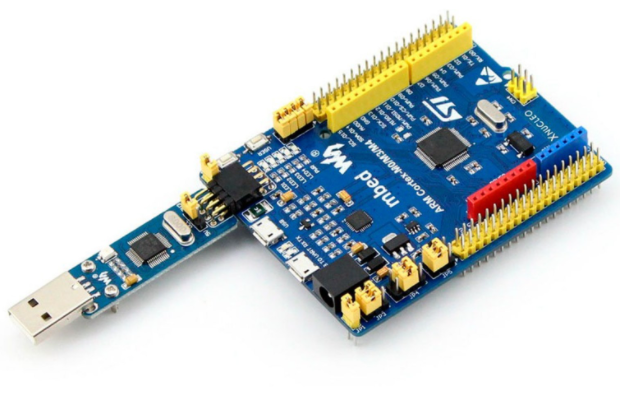
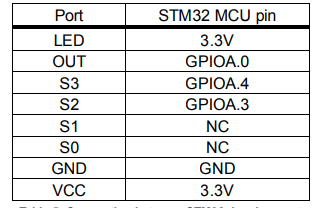
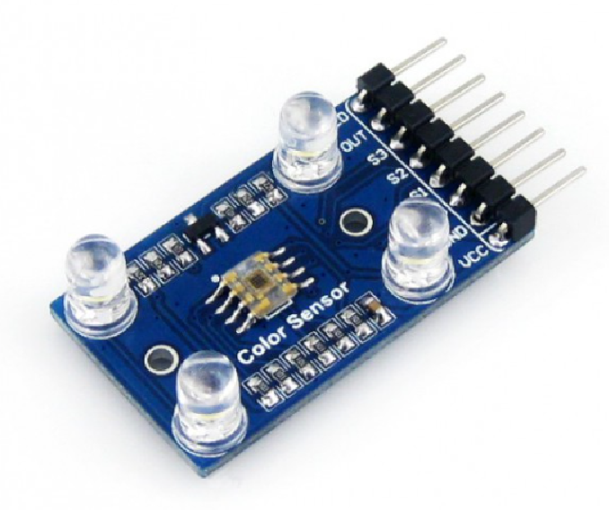
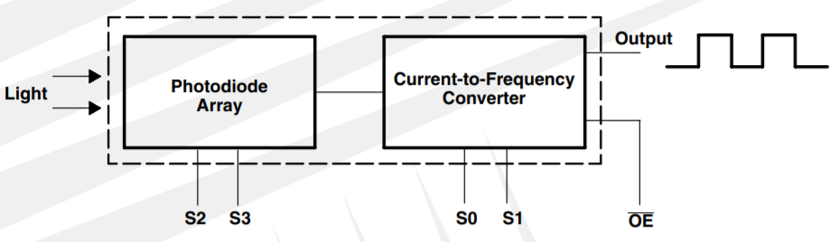
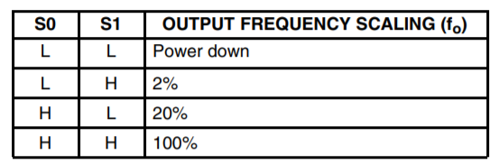
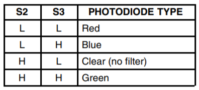

image::https://github.com/katyachalykh/Kursovaya/blob/main/Pictures/video.gif[]

== _Пояснительная записка к курсовому проекту_

==== Дисциплина: _программное обеспечение измерительных процессов._

==== Тема: _Разработка устройства подсчета красных объектов_

==== Выполнили студенты группы КЭ-413: _Кадыров Р.Э., Чалых Е.А._

== *_ВВЕДЕНИЕ_*

=== _Программное обеспечение_

Программное обеспечение (англ. software) – это набор инструкций,
позволяющий пользователю взаимодействовать с компьютером, его аппаратной
частью, выполнять задачи. Без программного обеспечения компьютеры
бесполезны.

Программное обеспечение является одним из видов обеспечения вычислительной
системы, наряду с техническим (аппаратным), математическим, информационным,
лингвистическим, организационным, методическим и правовым обеспечением.

=== _Язык программирования С++_

*Язык* *программирования* С++ представляет высокоуровневый компилируемый язык
программирования общего назначения со статической типизацией, который подходит для
создания самых различных приложений. На сегодняшний день С++ является одним из самых
популярных и распространенных языков.

Своими корнями он уходит в язык Си, который был разработан в 1969—1973 годах в
компании Bell Labs программистом Деннисом Ритчи (Dennis Ritchie). В начале 1980-х
годов датский программист Бьерн Страуструп (Bjarne Stroustrup), который в то время
работал в компании Bell Labs, разработал С++ как расширение к языку Си. Фактически
вначале C++ просто дополнял язык Си некоторыми возможностями объектно-ориентированного
программирования. И поэтому сам Страуструп вначале называл его как "C with classes"
("Си с классами").

Впоследствии новый язык стал набирать популярность. В него были добавлены новые
возможности, которые делали его не просто дополнением к Си, а совершенно новым
языком программирования. В итоге "Си с классами" был переименован в С++. И с тех по
оба языка стали развиваться независимо друг от друга.

- С++ является строго типизированным языком, а значит программы написанные
на нем более безопасны, чем программы написанные на Си и меньше
вероятность того, что программист допустит ошибку.

- С++ является языком программирования полностью поддерживающий парадигму
программирования ООП, которая отлично подходит для разработки
программного обеспечения измерительных устройств.

=== _Объектно ориентированное программирование_

*Объектно ориентированное программирование (ООП)* — методология
программирования, основанная на представлении программы в виде
совокупности объектов, каждый из которых является экземпляром
определённого класса, а классы образуют иерархию наследования.

*Основная задача ООП* — сделать сложный код проще. Для этого программу
разбивают на независимые блоки, которые называют объектами.

*_Основные понятия:_*

*Абстракция данных* — абстрагирование означает выделение значимой информации и
исключение из рассмотрения незначимой. В ООП рассматривают лишь абстракцию данных
(нередко называя её просто «абстракцией»), подразумевая набор значимых характеристик
объекта, доступный остальной программе.

*Инкапсуляция* — свойство системы, позволяющее объединить данные и методы, работающие
с ними, в классе. Одни языки (например, С++, Java или Ruby) отождествляют инкапсуляцию
с сокрытием, но другие (Smalltalk, Eiffel, OCaml) различают эти понятия.

*Наследование* — свойство системы, позволяющее описать новый класс на основе уже
существующего с частично или полностью заимствующейся функциональностью. Класс,
от которого производится наследование, называется базовым, родительским или
суперклассом. Новый класс — потомком, наследником, дочерним или производным классом.

*Полиморфизм подтипов (полиморфизм)* — свойство системы, позволяющее использовать
объекты с одинаковым интерфейсом без информации о типе и внутренней структуре объекта.
Другой вид полиморфизма — параметрический — в ООП называют обобщённым программированием.

*Класс* — универсальный, комплексный тип данных, состоящий из тематически единого
набора «полей» (переменных более элементарных типов) и «методов» (функций для работы
с этими полями), то есть он является моделью информационной сущности с внутренним и
внешним интерфейсами для оперирования своим содержимым (значениями полей).
В частности, в классах широко используются специальные блоки из одного или чаще двух
спаренных методов, отвечающих за элементарные операции с определенным полем (интерфейс
присваивания и считывания значения), которые имитируют непосредственный доступ к полю.

*Объект* — сущность в адресном пространстве вычислительной системы, появляющаяся при
создании экземпляра класса (например, после запуска результатов компиляции и
связывания исходного кода на выполнение).

=== _Операционные системы реального времени (ОСРВ(RTOS))_

*Операционные системы реального времени (ОСРВ(RTOS))* предназначены для
обеспечения интерфейса к ресурсам критических по времени систем реального
времени. Основной задачей в таких системах является своевременность
(timeliness) выполнения обработки данных.

Задачей RTOS является обеспечение реакции на определенное действие за
отведенный квант времени.

Для разных задач такой квант может иметь разное значение, например,
для обработки. Приблизительное время реакции в зависимости от области
применения RTOS может быть следующее:

- математическое моделирование — несколько микросекунд;
- радиолокация — несколько миллисекунд;
- складской учет — несколько секунд;
- управление производством — несколько минут.

Еще одной задачей RTOS является обеспечение многозадачности (или
псевдомногозадачности – обеспечение мнимого видения одновременного
исполнения нескольких операций).

Традиционно существует 2 версии многозадачности:

- «Мягкого» реального времени(soft real time).
- «Жесткого» реального времени(hard real time).

К RTOS мягкого типа можно отнести домашние компьютеры, т.е. пользователь
должен видеть, что, например, нажав кнопку с символом, он видит введенный
символ, а если же он нажал кнопку, и спустя время не увидел реакции,
то ОС будет считать задачу «не отвечающей» (по аналогии с Windows —
«Программа не отвечает»), но ОС остается пригодной для использования.
Таким образом, RTOS мягкого времени просто определяет предполагаемое
время ответа, и если оно истекло, то ОС относит задачу к не отвечающим.

К RTOS жесткого типа, как раз относят RTOS во встраиваемых устройствах.
В чем-то они похоже на RTOS на десктопах (многопоточное выполнение на
одном процессоре), но и имеют главное отличие — каждая задача должна
выполняться за отведенный квант времени, не выполнение данного условия
ведет к краху все системы.

Принцип работы и запуска задачи похож на принцип работы прерывания.
В RTOS, вместо прерываний используются задачи, которые вызываются
планировщиком каждый раз по прерыванию системного таймера (например
раз в 1 мс) или при непосредственном вызове планировщика.

Каждый раз планировщик пробегается по списку задач, выбирает задачу
готовую к работе.

- В кооперативной многозадачности планировщик смотрит, завершена ли
текущая задача и готова ли следующая (с большим приоритетом).
- В вытесняющей планировщик смотрит, готова ли более высокоприоритетная
задача, если да, он прерывает работу менее приоритетной задачи и
вызывает задачу в большим приоритетом.
- Планировщик озаботится тем, чтобы у каждой задачи все сохранялось и
запоминалось: текущее положение, стек, переменные, регистры.

.Рисунок 1

Бесплатная многозадачная операционная система реального времени (FreeRTOS)
для встраиваемых систем портирована на 35 микропроцессорных архитектур.

Планировщик системы очень маленький и простой, однако можно задать
различные приоритеты процессов, вытесняющую и невытесняющую
многозадачность, семафоры и очереди.

FreeRTOS мала и проста. Ядро системы умещается в 3—4 файлах.

=== _Среда разработки IAR Embedded Workbench_

*Интегрированная среда разработки IAR Embedded Workbench for ARM* является
профессиональной средой для разработки и отладки приложений для микроконтроллеров
с ядром ARM. Это мощный, но вместе с тем простой и очень удобный инструмент
программирования для встраиваемых микропроцессорных устройств и систем.

Процесс разработки программного обеспечения в общем случае ничем не отличается
от процесса разработки приложения для обычных компьютеров, который включает в себя
проектирование (Design), разработка кода (Develop), отладка (Debug).

.Рисунок 2

За последние время в среде разработки *IAR Embedded Workbench* был сделан огромный скачок с
точки зрения удобства использования, так и с точки зрения поддержки современных
стандартов. Так версия 8.X получила поддержку стандарта С14, а начиная с версии
8.40 и поддержку стандарт С17 и это является огромным плюсом для разработки
надежного, понятного и качественно ПО. В таблице 1 приведены основные характеристики
*IAR Embedded Workbench*.

.Характеристики IAR Embedded Workbench
[options="header"]
|=====================
|Характеристика|IAR Embedded Workbench
|Языки               |С/C++
|Стандарты языка     |С++ 17 начиная с версии 8.40
|Оптимизация кода    |Да, кроме condition_variable, future, mutex, shared_mutex, thread, поддержка
atomic урезана и реализована только для типов для которых есть аппаратная поддержка atomic
специальными командами в микроконтроллерах
|Контроль размера стека  |Да
|Поддержка RTOS  |Да
|Статический анализатор кода с набором правил |Да - MISRAC++2008, SECURITY,CERT, STDCHECKS
|Динамический анализ кода  |C-RUN
|Сертификация и проверка соответствию стандартам безопасности  |Сертификация на безопасность по стандартам IEC 61508 и ISO 26262 экспертной организацией TUV SUD – SIL3 сертификат
|Поддержка микроконтроллера STM32F411 RE |Полная
|=====================

== *_ОТЛАДОЧНАЯ ПЛАТА_*

Отладочная плата представляет собой печатную плату с установленным на ней
микроконтроллером, содержащую также дополнительные элементы и цепи, необходимые
для нормальной работы микроконтроллера, называемые обвязкой микроконтроллера.
Также отладочные платы содержат схемы связи с компьютером, разводку для подключения
плат расширения и работы с периферийными устройствами. Для каждой отладочной платы
существует множество плат расширения, например: постоянное запоминающее устройство
(ПЗУ), дисплей, клавиатура, датчики, преобразователи интерфейсов, приемопередатчики,
видеокамеры. Большинство отладочных плат можно программировать, используя только
компьютер с установленным на него специальным программным обеспечением, без
использования дополнительных программаторов или преобразователей интерфейсов.
Отладочные платы широко применяются при изучении микроконтроллеров, а также при
разработке прототипов устройств и в мелкосерийном производстве в качестве встраиваемых
плат управления. Существует множество различных отладочных плат, различающихся
используемым микроконтроллером, количеством выводов для подключения внешних устройств
и другими параметрами.

*XNUCLEO-F411RE* – это отладочная плата от компании Waveshare с поддержкой Arduino,
которая позволит изучить возможности микроконтроллера STM32F411RET6 на базе ядра
Cortex-M4. Функционал платы можно легко расширить, подключив к ней Arduino шилды,
а также на плате есть разъемы, через которые можно получить полный доступ к линиям
микроконтроллера портов ввода/вывода (I/O). Поддержка mbed делает возможным быстрое
построение прототипа устройства с использованием SDK и online инструментов.
Плата поставляется с отдельным модулем ST-Link/ V2.

.Рисунок 3

*Данная плата имеет следующие особенности:*

* ядро: ARM® 32-bit Cortex™-M4;
* рабочая частота: 100 МHz;
* рабочее напряжение: 1.7 V-3.6 V;
* память: 512 kB Flash, 128kB SRAM;
* интерфейсы: 1 x SDIO, 1 x USB 2.0 FS, 5 x SPI or 5 x I2S, 3 x USART, 3 x I2C;
* AD/ DA: 1 x AD (12 bit, 16 каналов);
* SPX3819M5: 3.3 V стабилизатор напряжения;
* AMS1117-5.0: 5.0 V стабилизатор напряжения;
* CP2102: USB-UART преобразователь;
* Arduino разъем: для подключения Arduino шилдов;
* ICSP interface: Arduino ICSP;
* USB-UART: для отладки;
* USB разъем: USB коммуникационный интерфейс;
* SWD interface: для программирования и отладки;
* ST Morpho разъемы: доступ к VCC, GND и ко всем портам I/O, для упрощения расширения;
* 6-12 V DC вход;
* пользовательская кнопка;
* кнопка Сброса;
* индикатор питания;
* 500 mA быстрый самовосстанавливающийся предохранитель;
* индикаторы последовательного порта Rx/Tx;
* 8 MHz кварцевый резонатор;
* 32.768 KHz кварцевый резонатор [20].

В микроконтроллере имеется 12 разрядный АЦП с 16 каналами и возможностью работы в
сканирующем режиме. Если подключить DMA канал, то данные с датчиков будет считываться
одновременно и записываться в определенный регистр, так можно получить стабильный
и быстрый темп получения данных.

Также TIM1 имеет возможность работать в режиме 16 битного ШИМ по четырем независимым
каналам.

=== _Микроконтроллер ST32F411RE_

Функциональные блоки микроконтроллера STM32F411 представлены на рисунке ниже.

.Рисунок 4
image::Pictures/picture4.png[]

Микроконтроллер STM32F411 имеет следующие характеристики.

[cols="a, a"]
|===
| *	32 разрядное ядро ARM Cortex-M4 | *	Блок работы с числами с плавающей точкой FPU
| *	512 кБайт памяти программ | *	128 кБайт ОЗУ
| * Встроенный 12 битный 16 канальный АЦП | *	DMA контроллер на 16 каналов
| *	USB 2.0 | *	3x USART
| * 5 x SPI/I2S | * 3x I2C
| * SDIO интерфейс для карт SD/MMC/eMMC | * Аппаратный подсчет контрольной суммы памяти программ CRC
| *	6 - 16 разрядных и 2 - 32 разрядных Таймера | *	1 - 16 битный для управления двигателями
| *	2  сторожевых таймера | *	1 системный таймер
| *	Работа на частотах до 100Мгц |* 81 портов ввода вывода
| *	Питание от 1.7 до 3.6 Вольт | * Потребление 100 мкА/Мгц
|===

*Дополнительные особенности микроконтроллера:*

*	Настраиваемые источники тактовой частоты;
*	Настраиваемые на различные функции порты;
*	Внутренний температурный сенсор;
*	Таймеры с настраиваемым модулем ШИМ;
*	DMA для работы с модулями (SPI, UART, ADC… );
*	12 разрядный ADC последовательного приближения;
*	Часы реального времени;
*	Системный таймер и спец. прерывания для облегчения и ускорения  работы ОСРВ.

=== _Ядро Cortex-М4_

* Ядро Cortex построено по гарвардской архитектуре с разделением шины данных и кода.
* Ядро Cortex-М4 поддерживает 8/16/32-разрядные операции умножения, которые
выполняются за 1 цикл (деление со знаком (SDIV) или без (UDIV) занимает от 2 до 12
тактов в зависимости от размера операндов.
* Ядро Cortex-М4 поддерживает 8/16/32-разрядные операции умножения со сложением.

Ядро Cortex-М4 имеет следующие характеристики.

[cols="4,4,4,4"]
|===
| Параметр​ | ARM7TDMI​ | ARM Cortex-M3​| ARM Cortex-M4​
| Архитектура​ | ARMv4T (Фон Неймана)​ | ARMv7 (Гарвардская)​ | ARMv7 (Гарвардская)​
| Набор инструкций​ | Thumb/ARM​ | Thumb/Thumb-2​ | Thumb/Thumb-2, DSP, SIMD, FP​
| Конвейер​ |  3 уровня​ | 3 уровня + предсказание ветвлений​ | 3 уровня + предсказание ветвлений​
| Прерывания​ | FIQ/IRQ​ | NMI (немаскируемые) + от 1 до 240 физических источников прерываний​ | NMI (немаскируемые) + от 1 до 240 физических источников прерываний​
| Длительность входа в обработчик прерывания​ |  24-42 цикла​ | 12 циклов​ | 12 циклов​
| Длительность переключения между обработчиками прерываний​ | 24 цикла​ | 6 циклов​ | 6 циклов​
| Режимы пониженного энергопотребления​ | Нет​ | Встроены​ | Встроены​
| Защита памяти​ | Нет​ | Блок защиты памяти с 8 областями​ | Блок защиты памяти с 8 областями​
| Производительность по тесту Dhrystone​ | 0,95 DMIPS/МГц |  1,25 DMIPS/МГц​ | 1,25 DMIPS/МГц​
| Энергопотребление ядра​ | 0,28 мВт/МГц​ | 0,19 мВт/МГц​ | 0,19 мВт/МГц​
| Аппаратный модуль работы с плавающей точкой ​| нет​ | нет​ | есть​
|===

== *_ЗАДАНИЕ_*

* Для разработки должна использоваться отладочная плата XNUCLEO-F411RE.
* Устройство должно подсчитывать количество красных объектов поднесенных к нему.
** При каждом определении красного объекта, счетчик объектов должен увеличиваться на 1.
** При кратковременном нажатии на кнопку, счетчик красных объектов должен быть сброшен.
** Для измеренения цвета объектов должен использоваться датчик цвета.
*** Скорость определения цвета должна быть не менее 100 ms.
*** Сенсор цвета должен быть подключен по следующей схеме.

.Рисунок 5

*** Для измерения частоты использовать порт PA.0 и таймер TIM1 канал 1.

* Перед работой устройство должно быть откалибровано.
** Для запуска калибровки использовать нажатие на USER Button более чем 2 секунды.

* Устройство должно передавать количество красных объектов по Bluetooth.
** Период вывода информации на Bluetooth должен быть 500ms.
** Формат вывода: +
"Количество красных помидоров:  XXX" +

* Архитектура должна быть представлена в виде UML диаграмм в пакете Star UML.
* Приложение должно быть написано на языке С++ с использованием компилятора ARM 8.40.2.

* При разработке должна использоваться Операционная Система Реального Времени FreeRTOS и С++ обертка над ней.

=== Перечень вопросов, подлежащих разработке

* В ходе работы необходимо разработать архитектуру программного обеспечения в виде диаграммы UML.
* В ходе работы необходимо разработать код программного обеспечения.
** Код должен соответствовать стандарту кодирования Стэнфордского университета.
* Работа программы должна быть продемонстрирована совместно с платой XNUCLEO-F411RE.
* Содержание работы должно соответствовать ГОСТ 19.402–78 "Единая система программной
документации. Описание программы".
** Работа должна быть оформлена в формате Asciidoc и выложена на Github
* Описание архитектуры в виде UML диаграмм должно быть оформлено в разделе "Описание логической структуры" -> "Алгоритм программы".
* Дополнительно к архитектуре, в разделе "Описание логической структуры" ->
"Структура программы с описанием функций составных частей и связи между ними"
должен быть описан принцип работы программы и взаимодействия разных блоков программы
друг с другом.
* Оформление пояснительной записки к курсовой работе в соответствии с СТО ЮУрГУ
04–2008 "Курсовое и дипломное проектирование. Общие требования к содержанию и
оформлению".

== *_АНАЛИЗ ТРЕБОВАНИЙ К КУРСОВОЙ РАБОТЕ_*

=== _Датчик цвета_

TCS3200 содержит четыре типа фильтров: красный, зеленый, синий
и прозрачный (без фильтра). Когда датчик освещается лучом света, типы фильтров
(синий, зеленый, красный или прозрачный), используемых устройством, могут быть
выбраны двумя логическими входами: S2 и S3. Четыре типа (цвета) фотодиодов чередуются,
чтобы свести к минимуму эффект неравномерности падающего излучения. Все фотодиоды
одного цвета подключены параллельно.

.Датчик цвета

Особенности датчика:

* однополярное питание от 2,7 В до 5,5 В;
* ошибка нелинейности 0,2% при 50 кГц;
* стабильный температурный коэффициент 200 ppm/°C;
* возможность установления доли от максимальной выходной частоты 2%, 20% и 100%.

.Функциональная схема

Для масштабирования выходной частоты используются каналы S0 и S1.

.Масштабирование выходной частоты

Для выбора типа фотодиода используются каналы S2 и S3.

.Выбор типа фотодиодов

Выходной величиной датчика является частота. При воздействии на фотодиоды датчика
определенного цвета, при включении соответствующего цветового фильтра, частота определенного
канала будет больше частоты других каналов (красный, синий, зеленый). Поэтому для
определения цвета необходимо попеременно изменять каналы.

=== _Общение с платой расширения должно осуществляться через USART2_

*USART* (_Universal Synchronous Asynchronous Receiver Transmitter_) – это модуль последовательного
ввода-вывода, который может использоваться для работы с периферийными устройствами, такими как терминалы
или персональные компьютеры, модемы, микросхемами *ЦАП*, *АЦП*, последовательными *EEPROM* и т.д.

*USART* может работать в трех режимах:

* асинхронный, полный дуплекс;
* ведущий синхронный, полудуплекс;
* ведомый синхронный, полудуплекс.

Модуль приемо-передатчика обеспечивает полнодуплексный обмен по последовательному каналу,
при этом скорость передачи данных может варьироваться в довольно широких пределах. Длина
посылки может составлять от 5 до 9 битов. В модуле присутствует схема контроля и формирования бита четности.

Для корректной работы *USART* необходимо выполнить следующие действия:

1) Подать тактирование на шину *USART*;

2) Настроить порты *A2, A3* в альтернативный режим;

3) Указать альтернативные функции *TX, RX* для соответствующих портов;

4) Указать скорость (_9600 бод_);

5) Включить модуль *USART*;

=== Выполнение работы:

=== _Разработка общей архитектуры программы_

_Архитектура программного обеспечения_ — совокупность важнейших
решений об организации программной системы.
Если говорить простым языком, архитектура программного обеспечения — это процесс
превращения таких характеристик
программного обеспечения, как: гибкость, масштабируемость, возможность реализации,
многократность использования и безопасность — в структурированное решение.

Архитектура включает:

* Выбор структурных элементов и их интерфейсов, с помощью которых составлена система,
а также их поведения в рамках сотрудничества структурных элементов.
* Соединение выбранных элементов структуры и поведения во всё более крупные системы.
* Архитектурный стиль, который направляет всю организацию — все элементы, их интерфейсы,
их сотрудничество и их соединение.

Для реализации устройства подсчитывающего количество красных объектов поднесенных к
нему, необходимо продумать и реализовать архитектуру программного обеспечения данного
устройства в соответствии с требованиями, приведенными в задании. Изучив необходимые
требования к устройству была разработана архитектура программного обеспечения
устройства. Она приведена на рисунке ниже.

РИСУНОК

Данная архитектура имеет четыре активные задачи: _ButtonTask_, _FrequenceMeasure_,
_CountTask_, _BlueToothTask_. Они наследуют обертку операционной системы реального
времени _FreeRTOS_ — _Thread_.

_HumidityTask_ это активная задача, которая выполняется под руководством операционной
системы реального времени. Данная задача выполняет функцию измерения влажности почвы.
Для этого она раз в 100мс обращается к классу _Humidity_ и вызывает его для
произведения измерений.

Класс _/////_ выполняет преобразование отфильтрованных кодов АЦП в процентное значение
влажности. Для выпонения данной операции класс _/////_ обращается за отфильтрованными
значениями к классу _Filter_, а для получения текущих значений кодов АЦП к интерфейсу
_IDataSource_, который предаставляет значения, находящиеся в классе _ADC_.

Класс _Filter_ получает входной код, производит его фильтрацию и возвращает
отфильтрованное значение кода.

_IDataSource_ — это интерфейс, который предоставляет доступ к данным, получаемым с
помощью АЦП.

Класс _ADC_ производит преобразование сигнала, получаемого с датчика влажности
_Moisture Sensor_, в цифровой вид, удобный для дальнейшего использования
и преобразования.

_BlueToothTask_ - это активная задача,которая производит запрос данных у
_HumidityTask_ и реализует их отправку пользователю по интерфейсу BlueTooth c
частотой один раз в 1000 мс в требуемом формате. Для преобразования данных в
требуемый формат задача обращается к классу _BlueTooth_.

Класс _BlueTooth_ производит преобразование данных, которые получены с _HumidityTask_ в
формат необходимый пользователю: _"Влажность почвы: ХХХ.ХХ"_. После произведенного
преобразования начинается отправка преобразованных даннных через интерфейс USART.
За отправку сообщения по USART отвечает класс _DriverUSART_.

Класс _DriverUSART_ - это класс, в котором реализуются функции отправки собщения, а
также происходит передача каждого последующего байта данных до окончания отправляемого
сообщения. Для произведения отправки сообщения необходимо включить передачу данных.
За это отвечает класс _USART_.

Класс _USART_ позволяет записать в массив данные, которые необходимо передать, а также
выполняет включение передачи данных.

Таким образом, разработанная нами архитектура, позволяет выполнять поставленную задачу
измерения влажности почвы, соответствуя требованиям, выдвинутым в задании. Следующим
этапом работы является детальная разработка архитектуры каждого класса и написание
рабочего кода.

=== Класс _USART_

Класс _USART_ включает в себя 4 метода. Каждый из них реализует определенную задачу.
Класс содержит в себе шаблон _TUSARTReg_.Он позволяет сделать код данного класса более
универсальным. Подключая различные библиотечные файлы можно настроить на работу как
модуль USART1, так и USART2 не внося изменения в код программы.
Опишем каждый метод класса подробнее:

* Метод _WriteByte()_ производит запись данных, которые необходимо отправить, в
регистр данных _DR_ микроконтроллера, а также ждет, пока не запишутся все данные,
так как длина посылаемого сообщения может изменяться.

* Метод _EnableTransmit()_ включает передачу данных путем установления бита _TE_
регистра _CR1_ в 1.

* Метод _SetSpeed()_ устанавливает скорость передачи данных по _USART_. Скорость может
быть различной. Она расчитывается по формуле: _СLK/(BaudRate*8*(2-OVER8))_, где

- _СLK_ - значение тактовой частоты микроконтроллера в герцах.
- _BaudRate_ - значение скорости передачи, которое необходимо установить.
- _OVER8_ - режим дискретизации (при установлении 1/16 записывается 0, а при
установлении 1/8 - 1).

Затем полученное значение записывается в регистр _BRR_.

* Метод _DisableTransmit()_ производит выключение передачи данных. Для этого бит
_TE_  регистра _CR1_ устанавливается в 0.

Архитектура класса _USART_ представлена на рисунке ниже:

image::https://github.com/musenzovakhomenko/KursovoyHumidity/blob/main/USART%20arch.jpg[]

Код класса _USART_ представлен ниже:

[,cpp]
----
#pragma once
#include <cstdint> // for uint8_t
//#include "itransmit.h" // for transmit

template <typename TUSARTReg>
class USART
 {
   public:
   void WriteByte (std::uint8_t byte) //записывает данные в регистр DR
    {
      TUSARTReg::DR::Write(byte);
      while(!TUSARTReg::SR::TXE::DataRegisterEmpty::IsSet())//ждем пока данные записываются
       {
       }
    }

   void EnableTransmit() //включает передачу данных
    {
      TUSARTReg::CR1::TE::Enable::Set();
    }

   void SetSpeed (std::uint16_t speed) // устанавливает скорость передачи данных
    {
      speed = (8'000'000/(9600*8*(2 - 0))) << 4U;
      TUSARTReg::BRR::Write(speed);
    }

   void DisableTransmit() //выключает передачу данных
    {
      TUSARTReg::CR1::TE::Disable::Set();
    }
 }
----

=== Класс _DriverUSART_

Клас _DrivrerUSART_ в своем составе имеет 3 метода. Данный класс содержит в себе ссылку
на класс _USART_. Он реализуется с помощью шаблона _aUsart_.

* Метод _SendMessage()_ реализует в себе включение передачи и отправку сообщения. В нем происходит
запись данных в масив, который формирует сообщение. Размер массива должен составлять не более 250
байт.Затем включается передача данных и происходит отправка сообщения.

* Метод _OnNextByteTransmit()_ производит передачу каждого последующего байта данных. Данная
операция происходит до окончания массива с данными. Затем передача выключается.

* Метод _SetSpeed()_ записывает значение скорости передачи данных по USART.

Архитектура класса _DriverUSART_ представлена на рисунке ниже:

image::https://github.com/musenzovakhomenko/KursovoyHumidity/blob/main/DriverUSART.jpg[]

Код класса _DriverUSART_ представлен ниже:

[,cpp]
----
#pragma once
#include <array>
#include <cassert>

template <auto& aUsart>
class DriverUSART
 {
   public:
   void SendMessage (const char* message, std:: size_t aSize)//включение передачи и отправка сообщения
    {
       assert(size <= 255);
       size = aSize;
       memcpy(transmitBuffer, message, size);
       OnNextByteTransmit();
       aUsart.EnableTransmit();
    }

   void OnNextByteTransmit()//передача каждого следующего байта данных
    {
      aUsart.WriteByte(transmitBuffer[i++]);
      if( i > size)
        {
          aUsart.DisableTransmit();
          i=0U;
        }
    }

   void SetSpeed(std::uint32_t speed)//записывает значение скорости передачи данных USART
   {
     aUsart.SetSpeed(speed);
   }

   private:
   std::size_t i=0U;
   std::uint8_t transmitBuffer[255];
   size_t size = 0U;
 };
----

=== Класс _BlueTooth_

Класс _BlueTooth_ содержит в себе один метод.Так же как и предыдущий,
данный класс содержит в себе ссылку
на класс _DriverUSART_. Он реализуется с помощью шаблона _aDriverUsart_.

* Метод _DataTransmit_ производит преобразование данных, в вид, требуемый пользователем и
начинает отправку сообщения. Для этого метод преобразует данные, полученные от класса _BlueToothTask_,
в строку и преобразует их в вид: _Влажность почвы: ХХХ.ХХ_ и затем начинает отправку сформированного
сообщения.

Архитектура класса _BlueTooth_ представлена на рисунке ниже:

image::https://github.com/musenzovakhomenko/KursovoyHumidity/blob/main/BlueTooth.jpg[]

Код класса _BlueTooth_ представлен ниже:

[,cpp]
----
#pragma once
#include <cstdio>
#include <iostream>

template <auto& aDriverUsart>
class BlueTooth
 {
   public:
   void DataTransmit(float value)
    {
      char str[30];
      sprintf(str, "Влажность почвы: %3.2f", value);
      aDriverUsart.SendMessage(str, strlen(str));
    }
 };
----

=== Класс _BlueToothTask_

Класс _BlueToothTask_ является активной задачей. Поэтому корректнее всего разделить его два файла
на файл где производится описание данного класса (файл _BlueToothTask.h_) и на файл, где описывается
реализация данного класса (файл _BlueToothTask.cpp_). Данный класс производит запрос данных для передачи
у _HumidityTask_ раз в 1000 мс, затем происходит событие - передача данных. Затем задача
переходит в спящий режим на 1000 мс.

Архитектура класса _BlueToothTask_ представлена на рисунке ниже:

image::https://github.com/musenzovakhomenko/KursovoyHumidity/blob/main/BlueToothTask.jpg[]

Рассмотрим файл описания данного класса - файл _BlueToothTask.h_
Так как устройство работает под управлением операционной системы реального времени FreeRTOS
введем пространство имен OsWrapper.
Класс _BlueToothTask_ содержит метод _Execute()_ и конструктор _BlueToothTask()_.
Реализация метода _Execute()_ приведена в файле _BlueToothTask.cpp_.

Код файла _BlueToothTask.h_ представлен ниже:

[,cpp]
----
#pragma once
#include "thread.hpp"
#include <cstdio>
#include <iostream>
#include "usart2registers.hpp"
#include "chrono"
#include "event.hpp"

using namespace OsWrapper;

class BlueToothTask : public Thread<128U>
 {
   public:
   void Execute();
   BlueToothTask();
 };
----

Рассмотрим файл реализации данного класса  - _BlueToothTask.cpp_.
Здесь класс _BlueToothTask_ содержит реализацию метода _Execute()_.
Метод _Execute()_ включает в себя бесконечный цикл. В нем реализуется получение значения с _HumidityTask_
и производится отправка полученного сообщения. Затем задача переходит в спящий режим на 1000 мс.

Код файла _BlueToothTask.срр_ представлен ниже:

[,cpp]
----
li,uiyjtrg
----

=== Класс _ADC_

Класс _ADC_ отвечает за настройку работы АЦП через модуль DMA, а также возвращает полученный код.
Он содержит в себе шаблон _TDMA_. Он позволяет сделать код данного класса более универсальным.
Подключая различные библиотечные файлы можно настроить на работу как модуль DMA1, так и DMA2 не внося
изменения в код программы.
Данный класс содержит в себе два метода:

* Конструктор _ADC()_ производит настройку работы АЦП. Первым делом подается тактирование на модуль DMA.
Затем для корректной работы DMA указывпем адрес периферии с которой требуется получать данные, потом
задаем адрес памяти в которой будут сохраняться полученные данные. Укажем направление передачи данных
в данном случае направление передачи из периферии в память. Затем необходимо указать количество посылаемых
сообщений, так как производится одно измерение будет посылаться одно сообщение. Затем укажем размерность данных
периферии и данных памяти. Они составят 16 бит. Установим приоритет преобразования - очень высокий.
Разрешим работу DMA в циклическом режиме и работу 0 канала DMA. Запустим АЦП на преобразование.

* Метод _GetCode()_ возвращает полученное с АЦП значение кода.

Архитектура класса _ADC_ представлена на рисунке ниже:

image::https://github.com/musenzovakhomenko/KursovoyHumidity/blob/main/ADC.jpg[]

Код класса _ADC_ представлен ниже:

[,cpp]
----
#pragma once
#include "rccregisters.hpp" // for RCC
#include "adc1registers.hpp"// for ADC

template<typename TDMA>
class ADC
 {
   public:
   ADC()
    {
      RCC::AHB1ENR::DMA2EN::Enable::Set();// разрешение тактирования для DMA2
      TDMA::S0CR::EN::Disable::Set();
      TDMA::S0PAR::Write(ADC1::DR::Address);// указываем адрес периферии
      TDMA::S0M0AR::Write(reinterpret_cast<std::uintptr_t>(&Code));//задаем адрес памяти
      TDMA::S0CR::DIR::Peripheraltomemory::Set(); //указываем направление передачи данных из переферии в память
      TDMA::S0NDTR::Write(1U); // количество пересылаемых сообщений
      TDMA::S0CR::PSIZE::Bit16::Set();// размерность данных периферии
      TDMA::S0CR::MSIZE::Bit16::Set();// размерность данных памяти
      TDMA::S0CR::PL::VeryHigh::Set();//приоритет - очень высокий
      TDMA::S0CR::CIRC::Enable::Set();//разрешаем работу dma в циклическом режиме
      TDMA::S0CR::EN::Enable::Set();//разрешаем работу 0 канала dma
      ADC1::CR2::SWSTART::On::Set();
    }

   uint32_t GetCode()
    {
      return Code;
    }

   private:
   std::uint32_t Code;
 };
----

=== Класс _IDataSourse_

Класс _IDataSourse_ является интерфейсом. Он предоставляет доступ к данным из АЦП.
В своем составе он имеет один абстрактный метод.

* Абстрактный метод _GetCode()_ позволяет классу _Humidity_ получить доступ к данным, получаемым
при помощи АЦП и хранящимся к классе _ADC_.

Архитектура класса _IDataSourse_ представлена на рисунке ниже:

image::https://github.com/musenzovakhomenko/KursovoyHumidity/blob/main/IDataSource.jpg[]

Код класса _IDataSourse_ представлен ниже:

[,cpp]
----
#pragma once

class IDataSource
 {
   public:
   virtual void GetCode() = 0;
 };
----

=== Класс _Filter_

Данный класс производит фильтрацию кодов АЦП. Он включает в себя два метода:

* Метод _Filter()_ является конструктором. В нем производится расчет постоянной фильтрации _tau_.
Она рассчитывается по формуле: _tau = 1-exp(-dt/RC)_, где

** _dt_ - это шаг дисретизации (выбрано значение равное 100),
** _RC_ - это постоянная времени (выбрано значение равное 1000).

Данная формула задана в техническом задании.

* Метод _Filtration()_ производит фильтрацию входного кода и возвращает отфильтрованное значение кода.
Отфильтрованное значение рассчитывается по формуле: _oldValue = oldValue + (Value - oldValue)*tau_, где

** _oldValue_ - хранит предыдущее отфильтрованное значение,
** _Value_ - хранит текущее значение кодов АЦП.

Данная формула задана в техническом задании.

Архитектура класса _Filter_ представлена на рисунке ниже:

image::https://github.com/musenzovakhomenko/KursovoyHumidity/blob/main/Filter.jpg[]

Код класса _Filter_ представлен ниже:

[,cpp]
----
#pragma once

class Filter
 {
   public:
   Filter()
   {
     tau = float(1.0f - exp(-(dt)/(RC))); // формула для фильтрации
   };

   uint32_t Filtration(const uint32_t Value) //Value - текущее измеренное значение влажности
   {
     oldValue = oldValue + (Value - oldValue)*tau;
     return oldValue;
   };

   private:
   float oldValue; //хранит предыдущее отфильтрованное значение
   float tau; //постоянная фильтрации
   static constexpr float dt = 100.0f; //шаг дискретизации
   static constexpr float RC = 1000.0f; //постоянная времени
 };
----

=== Класс _Humidity_

Этот класс рассчитывает значение по полученным из АЦП данным. В нем содержится два метода.
Данный класс содержит в себе ссылки на классы  _Filter_ и _IDataSource_. Они реализуются с помощью
шаблонов _aFilter_ и _DataSource_ соответственно. Рассмотрим каждый их методов в отдельности.

* Метод _ValueFiltration()_ производит фильтрацию полученных данных. Для этого он сначала получает данные
с АЦП, а затем фильтрует их с помощью фильтра.

* Метод _Calculate()_ производит преобразование отфильтрованных данных из АЦП в процентное значение
влажности. Для этого метод сначала получает отфильтрованные данные, а затем производит из расчет
используя полином пятой степени. Формирование полинома пятой степени производилось опытным путем. Был
произведен замер кодов в зависимости от влажности почвы с шагом 10%. Для этого была подготовленна сухая
почва массой 100 грамм. Затем были проведены замеры влажности в сухой почве, и в почве содержащей в себе
10% массы воды от всей массы почвы. Далее процентное содержание массы воды каждый раз увеличивалось на 10%.
Измерения проводились до содержание влажности в почве 60%, так как при повышение влажности более этого
значения коды АЦП выводились некорректно. Результаты измерений приведены в таблице ниже.

Таблица - Результаты полученных данных
|=======================================================
| Влажность почвы, %|Код АЦП
|          0        |  181
|          10       |  352
|          20       |  1168
|          30       |  1577
|          40       |  2012
|          50       |  2251
|          60       |  2420
|=======================================================

Для обработки полученных результатов и расчета по ним полинома был использован сервис _WolframAlpha_.
Результаты расчетов в данном сервисе приведены на рисунках ниже.

image::https://github.com/musenzovakhomenko/KursovoyHumidity/blob/main/Wolfram_1.jpg[]

image::https://github.com/musenzovakhomenko/KursovoyHumidity/blob/main/Wolfram_2.jpg[]

Таким образом, был получен полином: 1.50821*10^-14^*x^5^-1.02856*10^-10^*x^4^+2.64864*10^-7^*x^3^-
0.000309566*x^2^+0.172643*x-22.5334 по которому и производился расчет. Вместо х используется отфильтрованное
значение АЦП. В конце метод возвращает рассчитанное значение влажности.

Архитектура класса _Humidity_ представлена на рисунке ниже:

image::https://github.com/musenzovakhomenko/KursovoyHumidity/blob/main/Humidity.jpg[]

Код класса _Humidity_ представлен ниже:

[,cpp]
----
#pragma once
#include "Filter.h"
#include "IDataSource.h"
#include <iostream>

template <auto& aFilter, auto& DataSource>

class Humidity
 {
   public:
   float Calculate()
    {
      ValueFiltration();
      CalculateData = ((1.50821*(pow(10,(-14))))*(pow (FiltredValue,5)))-((1.02856*(pow(10,(-10))))*(pow(FiltredValue,4)))+((2.64864*(pow(10,(-7))))*(pow(FiltredValue,3)))-((0.000309566)*(pow(FiltredValue,2)))+(0.172643*FiltredValue)-22.5334;
      return CalculateData;
    }

   void ValueFiltration()
    {
       Value = DataSource.GetCode();
       FiltredValue = aFilter.Filtration(Value);
    }

   private:
   uint16_t Value;
   uint16_t FiltredValue;
   float CalculateData;
 };
----

=== Класс _HumidityTask_

Класс _HumidityTask_ также, как и _BlueToothTask_ является активной задачей. Поэтому также разделим его на два файла
файл _HumidityTask.h_ и на файл _HumidityTask.cpp_. Данный класс производит расчет значения влажности по кодам
АЦП и переходит в спящий режим на 100 мс.

Архитектура класса _HumidityTask_ представлена на рисунке ниже:

image::https://github.com/musenzovakhomenko/KursovoyHumidity/blob/main/HumidityTask.jpg[]

Рассмотрим файл описания данного класса - файл _HumidityTask.h_.
Так как устройство работает под управлением операционной системы реального времени FreeRTOS
введем пространство имен OsWrapper.
Класс _HumidityTask_ содержит метод _Execute()_ и конструктор _HumidityTask()_.
Реализация метода _Execute()_ приведена в файле _HumidityTask.cpp_.

Код файла _HumidityTask.h_. представлен ниже:

[,cpp]
----
#pragma once
#include "thread.hpp"
#include <cstdio>
#include <iostream>
#include "usart2registers.hpp"
#include "chrono"
#include "event.hpp"

using namespace OsWrapper;

class BlueToothTask : public Thread<128U>
 {
   public:
   void Execute();
   HumidityTask();
 };
----

Рассмотрим файл реализации данного класса  - _HumidityTask.cpp_.
Здесь класс _HumidityTask_ содержит реализацию метода _Execute()_.
Метод _Execute()_ включает в себя бесконечный цикл. В нем реализуется расчет значений
кодов АЦП во влажность. Затем задача переходит в спящий режим на 100 мс.

Код файла _HumidityTask.cpp_ представлен ниже:

[,cpp]
----
#include "HumidityTask.h"
#include "Humidity.h"
#include "IDataSource.h"
#include "Filter.h"
#include "ADC.h"
#include "dma2registers.hpp"

extern ADC<DMA2> adc;
extern Filter filter;
extern Humidity<filter, adc> humidity;

void HumidityTask::Execute()
 {
   for(;;)
    {
      humidity.Calculate();
      Sleep(100ms);
    }
}
----

