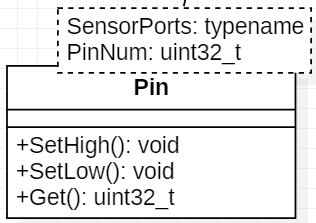
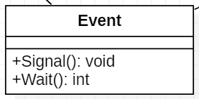

== _Пояснительная записка к курсовому проекту_

==== Дисциплина: _программное обеспечение измерительных процессов._

==== Тема: _Разработка устройства подсчета красных объектов_

==== Выполнили студенты группы КЭ-413: _Кадыров Р.Э., Чалых Е.А._

== *_ВВЕДЕНИЕ_*

=== _Программное обеспечение_

Программное обеспечение (англ. software) – это набор инструкций,
позволяющий пользователю взаимодействовать с компьютером, его аппаратной
частью, выполнять задачи. Без программного обеспечения компьютеры
бесполезны.

Программное обеспечение является одним из видов обеспечения вычислительной
системы, наряду с техническим (аппаратным), математическим, информационным,
лингвистическим, организационным, методическим и правовым обеспечением.

=== _Язык программирования С++_

*Язык* *программирования* С++ представляет высокоуровневый компилируемый язык
программирования общего назначения со статической типизацией, который подходит для
создания самых различных приложений. На сегодняшний день С++ является одним из самых
популярных и распространенных языков.

Своими корнями он уходит в язык Си, который был разработан в 1969—1973 годах в
компании Bell Labs программистом Деннисом Ритчи (Dennis Ritchie). В начале 1980-х
годов датский программист Бьерн Страуструп (Bjarne Stroustrup), который в то время
работал в компании Bell Labs, разработал С++ как расширение к языку Си. Фактически
вначале C++ просто дополнял язык Си некоторыми возможностями объектно-ориентированного
программирования. И поэтому сам Страуструп вначале называл его как "C with classes"
("Си с классами").

Впоследствии новый язык стал набирать популярность. В него были добавлены новые
возможности, которые делали его не просто дополнением к Си, а совершенно новым
языком программирования. В итоге "Си с классами" был переименован в С++. И с тех по
оба языка стали развиваться независимо друг от друга.

- С++ является строго типизированным языком, а значит программы написанные
на нем более безопасны, чем программы написанные на Си и меньше
вероятность того, что программист допустит ошибку.

- С++ является языком программирования полностью поддерживающий парадигму
программирования ООП, которая отлично подходит для разработки
программного обеспечения измерительных устройств.

=== _Объектно ориентированное программирование_

*Объектно ориентированное программирование (ООП)* — методология
программирования, основанная на представлении программы в виде
совокупности объектов, каждый из которых является экземпляром
определённого класса, а классы образуют иерархию наследования.

*Основная задача ООП* — сделать сложный код проще. Для этого программу
разбивают на независимые блоки, которые называют объектами.

*_Основные понятия:_*

*Абстракция данных* — абстрагирование означает выделение значимой информации и
исключение из рассмотрения незначимой. В ООП рассматривают лишь абстракцию данных
(нередко называя её просто «абстракцией»), подразумевая набор значимых характеристик
объекта, доступный остальной программе.

*Инкапсуляция* — свойство системы, позволяющее объединить данные и методы, работающие
с ними, в классе. Одни языки (например, С++, Java или Ruby) отождествляют инкапсуляцию
с сокрытием, но другие (Smalltalk, Eiffel, OCaml) различают эти понятия.

*Наследование* — свойство системы, позволяющее описать новый класс на основе уже
существующего с частично или полностью заимствующейся функциональностью. Класс,
от которого производится наследование, называется базовым, родительским или
суперклассом. Новый класс — потомком, наследником, дочерним или производным классом.

*Полиморфизм подтипов (полиморфизм)* — свойство системы, позволяющее использовать
объекты с одинаковым интерфейсом без информации о типе и внутренней структуре объекта.
Другой вид полиморфизма — параметрический — в ООП называют обобщённым программированием.

*Класс* — универсальный, комплексный тип данных, состоящий из тематически единого
набора «полей» (переменных более элементарных типов) и «методов» (функций для работы
с этими полями), то есть он является моделью информационной сущности с внутренним и
внешним интерфейсами для оперирования своим содержимым (значениями полей).
В частности, в классах широко используются специальные блоки из одного или чаще двух
спаренных методов, отвечающих за элементарные операции с определенным полем (интерфейс
присваивания и считывания значения), которые имитируют непосредственный доступ к полю.

*Объект* — сущность в адресном пространстве вычислительной системы, появляющаяся при
создании экземпляра класса (например, после запуска результатов компиляции и
связывания исходного кода на выполнение).

=== _Операционные системы реального времени (ОСРВ(RTOS))_

*Операционные системы реального времени (ОСРВ(RTOS))* предназначены для
обеспечения интерфейса к ресурсам критических по времени систем реального
времени. Основной задачей в таких системах является своевременность
(timeliness) выполнения обработки данных.

Задачей RTOS является обеспечение реакции на определенное действие за
отведенный квант времени.

Для разных задач такой квант может иметь разное значение, например,
для обработки. Приблизительное время реакции в зависимости от области
применения RTOS может быть следующее:

- математическое моделирование — несколько микросекунд;
- радиолокация — несколько миллисекунд;
- складской учет — несколько секунд;
- управление производством — несколько минут.

Еще одной задачей RTOS является обеспечение многозадачности (или
псевдомногозадачности – обеспечение мнимого видения одновременного
исполнения нескольких операций).

Традиционно существует 2 версии многозадачности:

- «Мягкого» реального времени(soft real time).
- «Жесткого» реального времени(hard real time).

К RTOS мягкого типа можно отнести домашние компьютеры, т.е. пользователь
должен видеть, что, например, нажав кнопку с символом, он видит введенный
символ, а если же он нажал кнопку, и спустя время не увидел реакции,
то ОС будет считать задачу «не отвечающей» (по аналогии с Windows —
«Программа не отвечает»), но ОС остается пригодной для использования.
Таким образом, RTOS мягкого времени просто определяет предполагаемое
время ответа, и если оно истекло, то ОС относит задачу к не отвечающим.

К RTOS жесткого типа, как раз относят RTOS во встраиваемых устройствах.
В чем-то они похоже на RTOS на десктопах (многопоточное выполнение на
одном процессоре), но и имеют главное отличие — каждая задача должна
выполняться за отведенный квант времени, не выполнение данного условия
ведет к краху все системы.

Принцип работы и запуска задачи похож на принцип работы прерывания.
В RTOS, вместо прерываний используются задачи, которые вызываются
планировщиком каждый раз по прерыванию системного таймера (например
раз в 1 мс) или при непосредственном вызове планировщика.

Каждый раз планировщик пробегается по списку задач, выбирает задачу
готовую к работе.

- В кооперативной многозадачности планировщик смотрит, завершена ли
текущая задача и готова ли следующая (с большим приоритетом).
- В вытесняющей планировщик смотрит, готова ли более высокоприоритетная
задача, если да, он прерывает работу менее приоритетной задачи и
вызывает задачу в большим приоритетом.
- Планировщик озаботится тем, чтобы у каждой задачи все сохранялось и
запоминалось: текущее положение, стек, переменные, регистры.

.Рисунок 1

Бесплатная многозадачная операционная система реального времени (FreeRTOS)
для встраиваемых систем портирована на 35 микропроцессорных архитектур.

Планировщик системы очень маленький и простой, однако можно задать
различные приоритеты процессов, вытесняющую и невытесняющую
многозадачность, семафоры и очереди.

FreeRTOS мала и проста. Ядро системы умещается в 3—4 файлах.

=== _Среда разработки IAR Embedded Workbench_

*Интегрированная среда разработки IAR Embedded Workbench for ARM* является
профессиональной средой для разработки и отладки приложений для микроконтроллеров
с ядром ARM. Это мощный, но вместе с тем простой и очень удобный инструмент
программирования для встраиваемых микропроцессорных устройств и систем.

Процесс разработки программного обеспечения в общем случае ничем не отличается
от процесса разработки приложения для обычных компьютеров, который включает в себя
проектирование (Design), разработка кода (Develop), отладка (Debug).

.Рисунок 2

За последние время в среде разработки *IAR Embedded Workbench* был сделан огромный скачок с
точки зрения удобства использования, так и с точки зрения поддержки современных
стандартов. Так версия 8.X получила поддержку стандарта С14, а начиная с версии
8.40 и поддержку стандарт С17 и это является огромным плюсом для разработки
надежного, понятного и качественно ПО. В таблице 1 приведены основные характеристики
*IAR Embedded Workbench*.

.Характеристики IAR Embedded Workbench
[options="header"]
|=====================
|Характеристика|IAR Embedded Workbench
|Языки               |С/C++
|Стандарты языка     |С++ 17 начиная с версии 8.40
|Оптимизация кода    |Да, кроме condition_variable, future, mutex, shared_mutex, thread, поддержка
atomic урезана и реализована только для типов для которых есть аппаратная поддержка atomic
специальными командами в микроконтроллерах
|Контроль размера стека  |Да
|Поддержка RTOS  |Да
|Статический анализатор кода с набором правил |Да - MISRAC++2008, SECURITY,CERT, STDCHECKS
|Динамический анализ кода  |C-RUN
|Сертификация и проверка соответствию стандартам безопасности  |Сертификация на безопасность по стандартам IEC 61508 и ISO 26262 экспертной организацией TUV SUD – SIL3 сертификат
|Поддержка микроконтроллера STM32F411 RE |Полная
|=====================

== *_ОТЛАДОЧНАЯ ПЛАТА_*

Отладочная плата представляет собой печатную плату с установленным на ней
микроконтроллером, содержащую также дополнительные элементы и цепи, необходимые
для нормальной работы микроконтроллера, называемые обвязкой микроконтроллера.
Также отладочные платы содержат схемы связи с компьютером, разводку для подключения
плат расширения и работы с периферийными устройствами. Для каждой отладочной платы
существует множество плат расширения, например: постоянное запоминающее устройство
(ПЗУ), дисплей, клавиатура, датчики, преобразователи интерфейсов, приемопередатчики,
видеокамеры. Большинство отладочных плат можно программировать, используя только
компьютер с установленным на него специальным программным обеспечением, без
использования дополнительных программаторов или преобразователей интерфейсов.
Отладочные платы широко применяются при изучении микроконтроллеров, а также при
разработке прототипов устройств и в мелкосерийном производстве в качестве встраиваемых
плат управления. Существует множество различных отладочных плат, различающихся
используемым микроконтроллером, количеством выводов для подключения внешних устройств
и другими параметрами.

*XNUCLEO-F411RE* – это отладочная плата от компании Waveshare с поддержкой Arduino,
которая позволит изучить возможности микроконтроллера STM32F411RET6 на базе ядра
Cortex-M4. Функционал платы можно легко расширить, подключив к ней Arduino шилды,
а также на плате есть разъемы, через которые можно получить полный доступ к линиям
микроконтроллера портов ввода/вывода (I/O). Поддержка mbed делает возможным быстрое
построение прототипа устройства с использованием SDK и online инструментов.
Плата поставляется с отдельным модулем ST-Link/ V2.

.Рисунок 3
image::Pictures/picture3.png[]

*Данная плата имеет следующие особенности:*

* ядро: ARM® 32-bit Cortex™-M4;
* рабочая частота: 100 МHz;
* рабочее напряжение: 1.7 V-3.6 V;
* память: 512 kB Flash, 128kB SRAM;
* интерфейсы: 1 x SDIO, 1 x USB 2.0 FS, 5 x SPI or 5 x I2S, 3 x USART, 3 x I2C;
* AD/ DA: 1 x AD (12 bit, 16 каналов);
* SPX3819M5: 3.3 V стабилизатор напряжения;
* AMS1117-5.0: 5.0 V стабилизатор напряжения;
* CP2102: USB-UART преобразователь;
* Arduino разъем: для подключения Arduino шилдов;
* ICSP interface: Arduino ICSP;
* USB-UART: для отладки;
* USB разъем: USB коммуникационный интерфейс;
* SWD interface: для программирования и отладки;
* ST Morpho разъемы: доступ к VCC, GND и ко всем портам I/O, для упрощения расширения;
* 6-12 V DC вход;
* пользовательская кнопка;
* кнопка Сброса;
* индикатор питания;
* 500 mA быстрый самовосстанавливающийся предохранитель;
* индикаторы последовательного порта Rx/Tx;
* 8 MHz кварцевый резонатор;
* 32.768 KHz кварцевый резонатор [20].

В микроконтроллере имеется 12 разрядный АЦП с 16 каналами и возможностью работы в
сканирующем режиме. Если подключить DMA канал, то данные с датчиков будет считываться
одновременно и записываться в определенный регистр, так можно получить стабильный
и быстрый темп получения данных.

Также TIM1 имеет возможность работать в режиме 16 битного ШИМ по четырем независимым
каналам.

=== _Микроконтроллер ST32F411RE_

Функциональные блоки микроконтроллера STM32F411 представлены на рисунке ниже.

.Рисунок 4
image::Pictures/picture4.png[]

Микроконтроллер STM32F411 имеет следующие характеристики.

[cols="a, a"]
|===
| *	32 разрядное ядро ARM Cortex-M4 | *	Блок работы с числами с плавающей точкой FPU
| *	512 кБайт памяти программ | *	128 кБайт ОЗУ
| * Встроенный 12 битный 16 канальный АЦП | *	DMA контроллер на 16 каналов
| *	USB 2.0 | *	3x USART
| * 5 x SPI/I2S | * 3x I2C
| * SDIO интерфейс для карт SD/MMC/eMMC | * Аппаратный подсчет контрольной суммы памяти программ CRC
| *	6 - 16 разрядных и 2 - 32 разрядных Таймера | *	1 - 16 битный для управления двигателями
| *	2  сторожевых таймера | *	1 системный таймер
| *	Работа на частотах до 100Мгц |* 81 портов ввода вывода
| *	Питание от 1.7 до 3.6 Вольт | * Потребление 100 мкА/Мгц
|===

*Дополнительные особенности микроконтроллера:*

*	Настраиваемые источники тактовой частоты;
*	Настраиваемые на различные функции порты;
*	Внутренний температурный сенсор;
*	Таймеры с настраиваемым модулем ШИМ;
*	DMA для работы с модулями (SPI, UART, ADC… );
*	12 разрядный ADC последовательного приближения;
*	Часы реального времени;
*	Системный таймер и спец. прерывания для облегчения и ускорения  работы ОСРВ.

=== _Ядро Cortex-М4_

* Ядро Cortex построено по гарвардской архитектуре с разделением шины данных и кода.
* Ядро Cortex-М4 поддерживает 8/16/32-разрядные операции умножения, которые
выполняются за 1 цикл (деление со знаком (SDIV) или без (UDIV) занимает от 2 до 12
тактов в зависимости от размера операндов.
* Ядро Cortex-М4 поддерживает 8/16/32-разрядные операции умножения со сложением.

Ядро Cortex-М4 имеет следующие характеристики.

[cols="4,4,4,4"]
|===
| Параметр​ | ARM7TDMI​ | ARM Cortex-M3​| ARM Cortex-M4​
| Архитектура​ | ARMv4T (Фон Неймана)​ | ARMv7 (Гарвардская)​ | ARMv7 (Гарвардская)​
| Набор инструкций​ | Thumb/ARM​ | Thumb/Thumb-2​ | Thumb/Thumb-2, DSP, SIMD, FP​
| Конвейер​ |  3 уровня​ | 3 уровня + предсказание ветвлений​ | 3 уровня + предсказание ветвлений​
| Прерывания​ | FIQ/IRQ​ | NMI (немаскируемые) + от 1 до 240 физических источников прерываний​ | NMI (немаскируемые) + от 1 до 240 физических источников прерываний​
| Длительность входа в обработчик прерывания​ |  24-42 цикла​ | 12 циклов​ | 12 циклов​
| Длительность переключения между обработчиками прерываний​ | 24 цикла​ | 6 циклов​ | 6 циклов​
| Режимы пониженного энергопотребления​ | Нет​ | Встроены​ | Встроены​
| Защита памяти​ | Нет​ | Блок защиты памяти с 8 областями​ | Блок защиты памяти с 8 областями​
| Производительность по тесту Dhrystone​ | 0,95 DMIPS/МГц |  1,25 DMIPS/МГц​ | 1,25 DMIPS/МГц​
| Энергопотребление ядра​ | 0,28 мВт/МГц​ | 0,19 мВт/МГц​ | 0,19 мВт/МГц​
| Аппаратный модуль работы с плавающей точкой ​| нет​ | нет​ | есть​
|===

== *_ЗАДАНИЕ_*

* Для разработки должна использоваться отладочная плата XNUCLEO-F411RE.
* Устройство должно подсчитывать количество красных объектов поднесенных к нему.
** При каждом определении красного объекта, счетчик объектов должен увеличиваться на 1.
** При кратковременном нажатии на кнопку, счетчик красных объектов должен быть сброшен.
** Для измеренения цвета объектов должен использоваться датчик цвета.
*** Скорость определения цвета должна быть не менее 100 ms.
*** Сенсор цвета должен быть подключен по следующей схеме.

.Рисунок
image::Pictures/picture6.png[]

*** Для измерения частоты использовать порт PA.0 и таймер TIM1 канал 1.

* Перед работой устройство должно быть откалибровано.
** Для запуска калибровки использовать нажатие на USER Button более чем 2 секунды.

* Устройство должно передавать количество красных объектов по Bluetooth.
** Период вывода информации на Bluetooth должен быть 500ms.
** Формат вывода: +
"Количество красных помидоров:  XXX" +

* Архитектура должна быть представлена в виде UML диаграмм в пакете Star UML.
* Приложение должно быть написано на языке С++ с использованием компилятора ARM 8.40.2.

* При разработке должна использоваться Операционная Система Реального Времени FreeRTOS и С++ обертка над ней.

== Перечень вопросов, подлежащих разработке

* В ходе работы необходимо разработать архитектуру программного обеспечения в виде диаграммы UML.
* В ходе работы необходимо разработать код программного обеспечения.
** Код должен соответствовать стандарту кодирования Стэнфордского университета.
* Работа программы должна быть продемонстрирована совместно с платой XNUCLEO-F411RE.
* Содержание работы должно соответствовать ГОСТ 19.402–78 "Единая система программной
документации. Описание программы".
** Работа должна быть оформлена в формате Asciidoc и выложена на Github
* Описание архитектуры в виде UML диаграмм должно быть оформлено в разделе "Описание логической структуры" -> "Алгоритм программы".
* Дополнительно к архитектуре, в разделе "Описание логической структуры" ->
"Структура программы с описанием функций составных частей и связи между ними"
должен быть описан принцип работы программы и взаимодействия разных блоков программы
друг с другом.
* Оформление пояснительной записки к курсовой работе в соответствии с СТО ЮУрГУ
04–2008 "Курсовое и дипломное проектирование. Общие требования к содержанию и
оформлению".

== *_АНАЛИЗ ТРЕБОВАНИЙ К КУРСОВОЙ РАБОТЕ_*

=== _Датчик цвета_

TCS3200 содержит четыре типа фильтров: красный, зеленый, синий
и прозрачный (без фильтра). Когда датчик освещается лучом света, типы фильтров
(синий, зеленый, красный или прозрачный), используемых устройством, могут быть
выбраны двумя логическими входами: S2 и S3. Четыре типа (цвета) фотодиодов чередуются,
чтобы свести к минимуму эффект неравномерности падающего излучения. Все фотодиоды
одного цвета подключены параллельно.

.Датчик цвета

Особеноости датчика:

* однополярное питание от 2,7 В до 5,5 В;
* ошибка нелинейности 0,2% при 50 кГц;
* стабильный температурный коэффициент 200 ppm/°C;
* возможность установления доли от максимальной выходной частоты 2%, 20% и 100%.

.Функциональная схема
image::Pictures/picture7.png[]

Для масштабирования выходной частоты используются каналы S0 и S1.

.Масштабирование выходной частоты
image::Pictures/picture8.png[]

Для выбора типа фотодиода используются каналы S2 и S3.

.Выбор типа фотодиодов

Выходной величиной датчика является частота. При воздействии на фотодиоды датчика
определенного цвета, при включении соответствующего цветового фильтра, частота определенного
канала будет больше частоты других каналов (красный, синий, зеленый). Поэтому для
определения цвета необходимо попеременно изменять каналы.

Для измерения частоты каждого канала было выбрано время 1000 мс. Для устранения помех при изменении
объекта измерения. Поэтому время передачи данных было увеличено до 5000 мс, чтобы успеть опросить все
каналы перед отправкой данных.

Также было решено не использовать кнопку как задачу калибровки.

Подключение портов представлено ниже. Порты датчика SO, S1, S2, S3 подключены на выход, в то время как
порт датчика OUT подключен как альтернативный.

[,cpp]
----
    GPIOA::MODER::MODER0::Alternate::Set();
    GPIOC::MODER::MODER11::Output::Set();
    GPIOC::MODER::MODER10::Output::Set();
    GPIOD::MODER::MODER2::Output::Set();
    GPIOC::MODER::MODER12::Output::Set();

    GPIOC::BSRR::BS11::High::Write();
    GPIOC::BSRR::BS10::High::Write();
----

Далее в классах _Red_, _Green_, _Clear_ и _Blue_ определяем статус порта, таким образом настраивая
каналы согласно рисунку 9.

=== _USART2_

USART (Universal Synchronous Asynchronous Receiver Transmitter) – это модуль последовательного
ввода-вывода, который может использоваться для работы с периферийными устройствами, такими как
терминалы или персональные компьютеры, модемы, микросхемами ЦАП, АЦП, последовательными EEPROM и
т.д.

USART может работать в трех режимах:

асинхронный, полный дуплекс;

ведущий синхронный, полудуплекс;

ведомый синхронный, полудуплекс.

Модуль приемо-передатчика обеспечивает полнодуплексный обмен по последовательному каналу, при
этом скорость передачи данных может варьироваться в довольно широких пределах. Длина посылки
может составлять от 5 до 9 битов. В модуле присутствует схема контроля и формирования бита
четности.

Для корректной работы USART необходимо выполнить следующие действия:

1) Подать тактирование на шину USART;

2) Настроить порты A2, A3 в альтернативный режим;

3) Указать альтернативные функции TX, RX для соответствующих портов;

4) Указать скорость (9600 бод);

5) Включить модуль USART;

Подключение USART ниже

[,cpp]
----
    USART2::CR1::M::Data8bits::Set();
    USART2::CR1::PCE::ParityControlDisable::Set();
    USART2::CR1::OVER8::OversamplingBy16::Set();
    USART2::CR2::STOP::Value0::Set();
    USART2::BRR::Write((16'000'000/(9600*8*2) << 4U));
    USART2::CR1::UE::Enable::Set();
    USART2::CR1::TE::Enable::Set();

    NVIC::ISER1::Write(1<<6);
----

=== _TIM2 в режиме захвата_

TIM1 и TIM8 содержат в себе 16-битный счетчик с возможностью автозагрузки, на который подается
тактовая частота через программируемый прескалер. Эти таймеры могут использоваться для различных
целей - измерения длительности импульсов входного сигнала (захват по входу, input capture) или
генерации выходных сигналов (вывод по событию сравнения счетчика output compare, генерация PWM,
комплементарного PWM со вставкой мертвого времени).

Для того чтобы обработать данные с датчика, необходимо измерять частоту на его выходе. Для этого
в микроконтроллере можно использовать Timer 1 и Timer 2 в режиме завхвата по входу (Input capture). В работе используется
Timer 2, т.к порт микроконтроллера на котороый подается сигнал с выхода датчика работает именно
с Timer 2.

В режиме Input capture регистры Capture/Compare (TIMx_CCRx) используются для защелкивания значения счетчика после детектирования изменения соответствующего сигнала ICx. Когда произошел захват, установится соответствующий флаг CCXIF (в регистре TIMx_SR) и может произойти прерывание или запрос DMA, если они разрешены. Если захват произошел, когда флаг CCxIF уже в лог. 1, то установится флаг over-capture CCxOF (регистр TIMx_SR). CCxIF может быть очищен программно записью в него 0 или путем чтения захваченных данных, сохраненных в регистре TIMx_CCRx. CCxOF очищается, когда в него записывается 0.

Следующий пример показывает, как захватывать значение счетчика в TIMx_CCR1, когда на входе TI1 появляется фронт нарастания уровня. Чтобы добиться этого, используйте следующую процедуру:

• Выберите активный вход: TIMx_CCR1 должен быть связан со входом TI1, для этого запишите в биты CC1S регистра TIMx_CCMR1 значение 01. Как только значение CC1S станет отличаться от 00, канал будет сконфигурированным на ввод, и регистр TIMx_CCR1 получит доступ только для чтения.
• Запрограммируйте необходимую длительность входного фильтра в соответствии с сигналом поступающим на таймер (путем программирования бит ICxF в регистре TIMx_CCMRx, если в качестве входа используется TIx). Представим, что при переключении уровня входной сигнал нестабилен в течение не менее 5 внутренних циклов тактов. Мы должны запрограммировать длительность фильтра на время больше, чем эти 5 периодов тактов. Мы можем подтвердить достоверность перехода уровня TI1, когда будут определены 8 соседних выборок с новым уровнем (выборки делаются на частоте fDTS). Затем записать биты IC1F в 0011 регистра TIMx_CCMR1.
• Выберите активный перепад на канале TI1 записью бит CC1P и CC1NP в лог. 0 регистра TIMx_CCER (перепад нарастания уровня).
• Запрограммируйте входной прескалер. В нашем примере мы хотим делать захват на наждом допустимом перепаде по входу, поэтому прескалер запрещаем (запишем 00 в биты IC1PS регистра TIMx_CCMR1).
• Разрешите захват из счетчика в регистр захвата установкой бита CC1E в регистре TIMx_CCER.
• Если это необходимо, разрешите соответствующий запрос прерывания установкой бита CC1IE в регистре TIMx_DIER, и/или запрос DMA установкой бита CC1DE в регистре TIMx_DIER.

Когда происходит input capture:

• Регистр TIMx_CCR1 получает значение счетчика на активном перепаде.
• Установится флаг CC1IF (флаг прерывания). Также установится CC1OF, если произошли как минимум 2 следующих друг за другом захвата, в то время как флаг CC1IF не был очищен.
• Генерируется запрос прерывания в зависимости от бита CC1IE.
• Генерируется запрос DMA в зависимости от бита CC1DE.

Настройка захвата по входу представлена ниже.

[,cpp]
----
    GPIOA::AFRL::AFRL0::Af1::Set();

    NVIC::ISER0::Write(1<<28);
    TIM2::CR1::URS::OverflowEvent::Set();
    RCC::APB1ENR::TIM2EN::Enable::Set();
    TIM2::PSC::Set(0U);
    TIM2::SR::UIF::NoInterruptPending::Set();
    TIM2::CNT::Write(0U);
    TIM2::CR1::CEN::Enable::Set();

    TIM2::CCMR1_Input::CC1S::Value1::Set();
    TIM2::CCMR1_Input::IC1F::Value2::Set();
    TIM2::CCER::CC1P::Value0::Set();
    TIM2::CCER::CC1NP::Value0::Set();
    TIM2::CCMR1_Input::ICPCS::Value2::Set();
----

Для управления режимом захвата был создан класс Timer2. В нем прописано два метода которые разрешают
захват и прерывание, а также запрещают их. Эти методы представлены ниже.

[,cpp]
----
  void Start()
 {
    TIM2::CCER::CC1E::Value1::Set();
    TIM2::DIER::CC1IE::Enable::Set();
    HandleInterrupt();
 }

  void Stop()
 {
    TIM2::CCER::CC1E::Value0::Set();
    TIM2::DIER::CC1IE::Disable::Set();
 }
----

А также метод, который проверяет разрешен ли захват и прерывание, и если да, то считает период.

[,cpp]
----
 void HandleInterrupt()
 {
   if (TIM2::CCER::CC1E::Value1::IsSet() && TIM2::DIER::CC1IE::Enable::IsSet())
    {
       float currentvalue = TIM2::CCR1::Get();
       period = ((currentvalue - previouse)/4.0f)*timerClock;
       pCurrentChannel -> OnInterrupt(period);
       previouse = currentvalue;
    }
 }
----

== *_ВЫПОЛНЕНИЕ РАБОТЫ_*

=== _Разработка общей архитектуры программы_

_Архитектура программного обеспечения_ — совокупность важнейших
решений об организации программной системы.
Если говорить простым языком, архитектура программного обеспечения — это процесс
превращения таких характеристик
программного обеспечения, как: гибкость, масштабируемость, возможность реализации,
многократность использования и безопасность — в структурированное решение.

Архитектура включает:

* Выбор структурных элементов и их интерфейсов, с помощью которых составлена система,
а также их поведения в рамках сотрудничества структурных элементов.
* Соединение выбранных элементов структуры и поведения во всё более крупные системы.
* Архитектурный стиль, который направляет всю организацию — все элементы, их интерфейсы,
их сотрудничество и их соединение.

Для реализации устройства подсчитывающего количество красных объектов поднесенных к
нему, необходимо продумать и реализовать архитектуру программного обеспечения данного
устройства в соответствии с требованиями, приведенными в задании. Изучив необходимые
требования к устройству была разработана архитектура программного обеспечения
устройства. Она приведена на рисунке ниже.

Данная архитектура имеет четыре активные задачи: _ButtonTask_, _FrequenceMeasure_,
_CountTask_, _BlueToothTask_. Они наследуют обертку операционной системы реального
времени _FreeRTOS_ — _Thread_.

_FrequenceMeasure_ это задача, которая  выполняет функцию смены каналов цветовых фильтров,
а также включения и выключения таймера между каналами для перехода измерений частоты.
Значение частоты и канал записываются в массив.

Класс _CountTask_ является счетчиком, получая данные о массиве, он передает их определителю
красных объектов. После чего ведет счетчик красных объектов, а также ожидает нажатия кнопки,
при который обнуляет счетчик. Также возвращает значение счетчика классу _BlueToothTask_.

Класс _ButtonTask_ запрашивает каждые 100 мс нажата ли кнопка.

Класс _BlueToothTask_ Передача температуры по Bluetooth инициируется задачей BlueToothTask
каждые 1000 мс. Для этого значение полученное из класса CountTask передается в класс
USARTDriver. Передача осуществляется с помощью прерывания по передаче: передача первого байта
строки вызывает прерывание, в обработчике которого отправляется следующий байт. Прерывания
будут происходить до тех пор, пока не будет передан последний байт строки. В ходе работы
выяснилось, что подключение датчика не дает возможность передать данные по Bluetooth, поэтому
решено отправлять их в терминал на ПК по USART.

=== _Подробное описание архитектуры_

Класс _Pin_ необходим для задачи входных портов цветовых фильтров и выходного порта кнопки.

Класс _IPin_ является интерфейсом и необходим для доступа классов _Button_, _Red_, _Green_,
_Clear_ и _Blue_ к методам класса _Pin_.

Классы _Red_, _Green_, _Clear_ и _Blue_, определяют уровень пинов для подключения к
к соответствующим им цветовым фильтрам.

Класс _IColorChannel_ является интерфейсом и необходим для доступа классов _FrequenceMeasure_ и
_Timer2_ к методам классов _Red_, _Green_, _Clear_ и _Blue_.

Класс _Timer2_ класс, который нобходим для измерения частоты на входе датчика, используя
функцию захвата. А также создает методы для включения и выключения данного режима

Класс _RedObjectDetector_ класс, который определяет цвет объекта, находящегося перед датчиком
путем сравнения получаемых частот на каналах.

Класс _Button_ класс, который определяет нажатие кнопки.

image::Pictures/IBut.png[]

Класс _IButton_ является интерфейсом и необходим для доступа класса _ButtonTask_
к методу класса _Button_.

Класс _Event_ класс, который позволяет ожидать события нажатия кнопки и отправляет сигнал,
если событие произошло.

Класс _Usart_ класс, который позволяет включать и выключать передачу данных, разрешать и
запрещать прерывания по передаче и записывает данные в регистр DR.

Класс _ITransmit_ является интерфейсом и необходим для доступа класса _UsartDriver_ к методу
класса _Usart_.

Класс _UsartDriver_ класс, который отвечает за побайтовую передачу сообщения, хранит размер строки и
и номер элемента строки.

== *_РЕЗУЛЬТАТ РАБОТЫ_*

image::https://github.com/katyachalykh/Kursovaya/blob/main/Pictures/video.gif[]

=== _Вывод_

В ходе работы было изменено время обработки каждого канала датчика и время передачи данных. Также
было решено отказаться от модуля Bluetooth, т.к. подключение датчика цвета и модуль беспероводной
связи было сложно подключить одновременно, поэтому данные передавались на ПК в терминал по USART.
Также было решено не проводить калибровку.
В итоге получили программу , которая опрашивала попеременно каналы цвета каждые 1000 мс и считывала
частоту на выходе датчика. Сравнивала эти результаты и определяла цвет объекта. Вела учет красных
объектов и передавала их количество в терминал. При нажатии кнопки обнуляла счетчик и учет велся заново.

